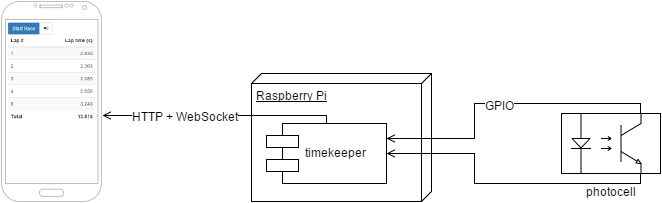

Timekeeper for doing time trials with my RC car model
=====================================================

This is a Spring Boot application accessible via standard web browser
that sits on a Raspberry Pi and is connected to a photocell. When the
model car passes the start line, the photocell is interrupted
and Timekeeper displays lap times and total race time.

