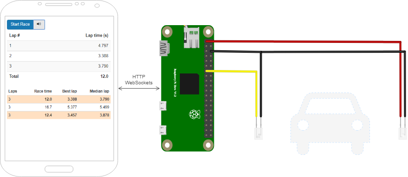

Timekeeper for doing time trials with my RC car model
=====================================================

This is a Spring Boot application accessible via standard web browser
that sits on a Raspberry Pi and is connected to a photocell. When the
model car passes the start line, the photocell is interrupted
and the timekeeper displays lap times and total race time. See it
[in action on youtube](https://youtu.be/ngSASHEzw80).

[](https://youtu.be/ngSASHEzw80)

Usage Instructions
------------------

1. Get a photocell with open collector transistor output, like [this one][photocell].
1. Connect photocell power and ground as needed, and its output to [pin 13].
1. Build `fun-timekeeper.jar` using maven or download the [latest release].
1. Launch the timekeeper on your raspberry using java:
   ```bash
   java -jar -DlapsPerRace=3 fun-timekeeper-1.0.jar
   ``` 
1. Open `http://address-of-your-pi:8080/` in the browser.
1. Click _Start Race_ and put pedal to the metal.  

To clean the records remove `races.json` and restart the app.

[latest release]: https://github.com/gdela/fun-timekeeper/releases/latest
[photocell]: https://www.adafruit.com/product/2167
[pin 13]: https://pinout.xyz/pinout/pin13_gpio27
